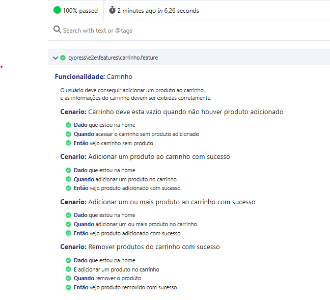
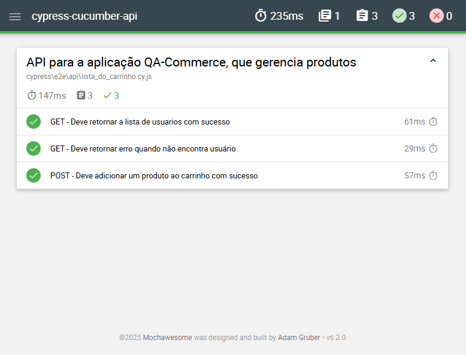

# Cypress  + Cucumber and API Test

Content produced for API and Web template with cucumber

# Requirements

The minimum requirements are:

* Node 
* Cypress

# Setup

```
npm install
```

# Test Execution web

To run the tests in headless mode, go to main directory and execute:

```
npm run execution
```

Result and coverage

```
open folder in cucumber-results/report
```




To open the Cypress IDE, run:

```
npm run open
```
# Test Execution api

```
npm run open
```

To open the Cypress IDE, run:

```
npm run test:api
```
Result and coverage
```
open folder in reports/index.html
```



# Links
    
[Cypress](<https://www.cypress.io/>)

[cypress-cucumber-preprocessor](<https://github.com/badeball/cypress-cucumber-preprocessor>)
